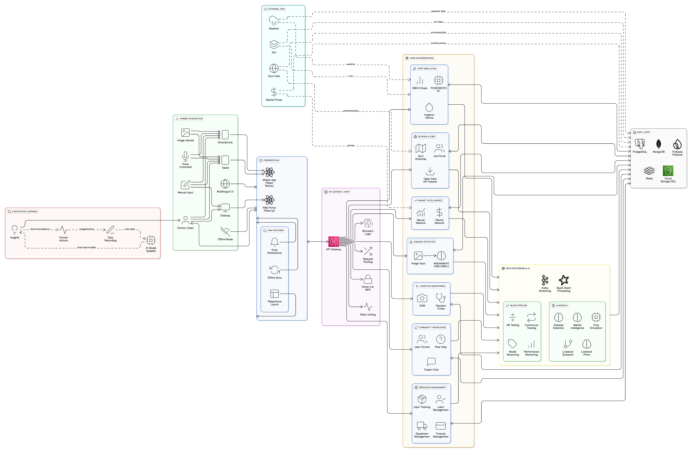

# CrispRoot Platform 🌾

A comprehensive agricultural technology platform that transforms traditional farming into a smart, digital-first experience. This system serves as a real-time digital twin of farms, empowering farmers, agronomists, and developers with AI-driven insights, predictive analytics, and intelligent monitoring capabilities 

## Overview

It reimagines agriculture through four core domains: market analysis, crop simulation, plant disease detection, and livestock health management. The platform combines data-driven decision making with real-time monitoring to optimize agricultural operations, increase profitability, and ensure sustainable farming practices.

## ✨ Key Features

### 🧠 AI Garden Advisor
- **Personalized Recommendations**: Tailored crop suggestions using Google Gemini AI
- **Multi-language Support**: Translations available in 10+ Indian languages
- **Smart Input Processing**: Considers location, soil type, budget, and experience level.

### 📊 Market Demand Analysis
- **Predictive Analytics**: Neural Perceptron model for 12-month demand forecasting
- **Market Intelligence**: Seasonality analysis and optimal selling period recommendations
- **Pricing Strategy**: Net market price calculations including transportation costs
- **Data Source**: Variety-wise Daily Market Prices from Open Government Data Platform.

### 🌱 Crop Simulation & Growth Monitoring
- **PCSE Framework**: Python Crop Simulation Environment based on WOFOST principles
- **Real-time Monitoring**: Daily plant growth simulation with live updates
- **Growth Metrics**: Yield predictions, biomass accumulation, Leaf Area Index (LAI)
- **BBCH Integration**: Growth stage identification based on research standards.

### 🔍 Plant Disease Detection
- **High Accuracy**: 90% accuracy using MobileNetV2 architecture
- **Comprehensive Coverage**: Detects 80 different plant diseases
- **Dataset**: Trained on Plant Village and 20K Crop Disease datasets
- **Instant Results**: Real-time disease identification with confidence scores.

### 🐄 Livestock Disease Prediction
**Dual-Model Approach**:
- **Symptom-Based**: 80% accuracy using Random Forest algorithm for 5 major diseases
- **Appearance-Based**: 70% accuracy using MobileNetV2 for 7 cattle conditions
- **Disease Coverage**: Pneumonia, Lumpy Skin Virus, Blackleg, Foot and Mouth Disease, Anthrax.

### 🌍 Green Guardian
- **Environmental Monitoring**: Real-time weather alerts and emergency response
- **Interactive Features**: Chat interface, live dashboard, map views
- **Satellite Integration**: Satellite imagery analysis for comprehensive monitoring.

### 🎤 Multilingual AI Assistant
- **Voice & Text Support**: Available in 10+ Indian languages
- **Call-based AI Bot**: Phone support for farmers with feature phones
- **WhatsApp Integration**: Bot support for broader accessibility


# 🧩 CrispRoot Interaction Architecture



> _“Farmer-Centric Smart Agriculture Architecture: CrispRoot Platform”_

This architecture diagram represents how a **farmer interacts with the CrispRoot platform**, flowing through a multi-layered intelligent system that bridges user actions with data-driven insights and automation. The platform serves as a **digital twin of a farm**, offering real-time decision-making, monitoring, and AI-powered advisory across agriculture domains.

---

## 🔹 1. Farmer Interaction Layer

**Label:** `Farmer (User)`  
- Access via smartphone, tablet, or computer  
- Interaction Types:
  - Voice command  
  - Image upload (leaf/livestock)  
  - Manual input (text/forms)  
  - Multilingual UI (10+ Indian languages)  
  - Offline support via call-based AI bot  

---

## 🔹 2. Presentation Layer

- **Mobile App** – Built with React Native  
- **Web Portal** – Built with React.js  
- **PWA Features**:
  - Offline sync
  - Push notifications
  - Responsive layouts for all devices

---

## 🔹 3. API Gateway Layer

- Unified API Gateway handling:
  - OAuth 2.0 & Multi-Factor Authentication  
  - Biometric login  
  - Secure routing & rate limiting  

---

## 🔹 4. Core Microservices (Business Logic)

| Module | Functionality |
|--------|---------------|
| **Crop Simulation** | PCSE/WOFOST simulation, BBCH tracking, irrigation/fertilizer advice |
| **Plant Disease Detection** | Image classification using MobileNetV2 |
| **Livestock Monitoring** | Symptom-based (Random Forest) and image-based (CNN) disease detection |
| **Market Intelligence** | 12-month demand forecasting, pricing strategy using Neural Perceptron |
| **Govt. Scheme Navigator** | Scheme/job matching via open data APIs |
| **Community Platform** | Peer-to-peer help, expert Q&A |
| **Resource Manager** | Track labor, equipment, expenses |

---

## 🔹 5. Data Processing & AI Layer

- **Streaming:** Apache Kafka  
- **Batch Processing:** Apache Spark  
- **MLOps Capabilities**:
  - Automated model retraining  
  - A/B testing  
  - Version control  
  - Performance monitoring  

**AI Models in Use**:
- MobileNetV2 (Plant & Livestock Disease)  
- Neural Perceptron (Market Demand Forecast)  
- PCSE/WOFOST (Crop Simulation)  
- Random Forest (Livestock Symptom Analysis)

---

## 🔹 6. Data Layer – Polyglot Storage

- **Firebase Firestore** – Real-time farm data  
- **PostgreSQL** – Structured crop & user data  
- **MongoDB** – Unstructured logs & media  
- **Redis** – Fast caching for performance  
- **Cloud Storage (AWS S3)** – Leaf/livestock images

---

## 🔹 7. External APIs & Data Feeds

- **Weather** – OpenWeatherMap API  
- **Soil** – ISRIC SoilGrids API  
- **Market** – Agmarknet API  
- **Govt. Schemes** – India Open Government API

---

## 🔹 8. Feedback Loop (Learning Cycle)


This loop ensures **adaptive intelligence** where the system improves over time using real-world feedback and seasonal variation.


---

## 🛠️ Tech Stack

### Frontend
- **React** with TypeScript
- **Next.js** for server-side rendering
- **Vite** for fast development builds
- **Tailwind CSS** + PostCSS for styling
- **Chart.js** & **Recharts** for data visualization
- **i18next** for internationalization

### Backend & Services
- **Node.js** with TypeScript
- **PostgreSQL** database
- **Prisma ORM** for database interactions
- **tRPC** for type-safe API layer
- **Python Flask** for ML model inference
- **Google Gemini AI** for recommendations and translations
- **Firebase** for cattle farm management

### Machine Learning
- **MobileNetV2** for disease detection
- **Random Forest** for livestock symptom analysis
- **Neural Perceptron** for market demand forecasting
- **PCSE** (Python Crop Simulation Environment)

## 🚀 How to Run

### Prerequisites
- Node.js (v18 or higher)
- Python 3.8+
- PostgreSQL database
- Firebase account
- Google Gemini API key

### Installation

1. **Clone the repository**
```bash
git clone https://github.com/annam-ai-iitropar/team_1B.git
```

2. **Install dependencies**
```bash
# Frontend dependencies
npm install

# Backend dependencies
cd backend
npm install

# Python ML service
cd ../ml-service
pip install -r requirements.txt
```

3. **Environment Setup**
```bash
# Copy environment files
cp .env.example .env.local
cp backend/.env.example backend/.env
cp ml-service/.env.example ml-service/.env
```

4. **Database Setup**
```bash
# Run Prisma migrations
cd backend
npx prisma migrate dev
npx prisma generate
```

5. **Start the services**
```bash
# Start ML service
cd ml-service
python app.py

# Start backend
cd ../backend
npm run dev

# Start frontend
cd ../
npm run dev
```

### Configuration

Update the following environment variables:
- `DATABASE_URL`: PostgreSQL connection string
- `GOOGLE_GEMINI_API_KEY`: Google Gemini API key
- `FIREBASE_CONFIG`: Firebase configuration
- `WEATHER_API_KEY`: Weather service API key

## 📱 Accessibility Features

- **Responsive Design**: Works on smartphones, tablets, and desktop
- **Voice Integration**: Voice-to-text and text-to-speech capabilities
- **Multi-language Support**: 10+ Indian regional languages
- **Offline Capability**: Phone call support for feature phones
- **Gamification**: Engaging user experience with gamified elements

## 🔄 System Architecture

The platform follows a modular architecture with clean separation of domains:

1. **Data Layer**: PostgreSQL database stores farms, plots, crops, and sensor data
2. **API Layer**: tRPC provides type-safe communication between frontend and backend
3. **ML Layer**: Python Flask service hosts machine learning models
4. **Frontend Layer**: React-based dashboard with real-time updates
5. **AI Layer**: Google Gemini AI for recommendations and translations

## 📊 Performance Metrics

- **Plant Disease Detection**: 90% accuracy
- **Livestock Symptom Analysis**: 80% accuracy
- **Livestock Appearance Analysis**: 70% accuracy
- **Market Prediction**: 12-month forecasting capability
- **Real-time Updates**: 2-30 second configurable refresh intervals


## 📄 License

This project is licensed under the MIT License - see the [LICENSE](LICENSE) file for details.

## 🙏 Acknowledgments

- Plant Village Dataset and 20K Crop Disease Dataset from Kaggle.
- BBCH Scale Documentation for crop growth modeling.
- Open Government Data Platform for market price data.
- SLIIT-KUEMD Dataset for cattle disease prediction.

**Built with ❤️ for the farming community**

